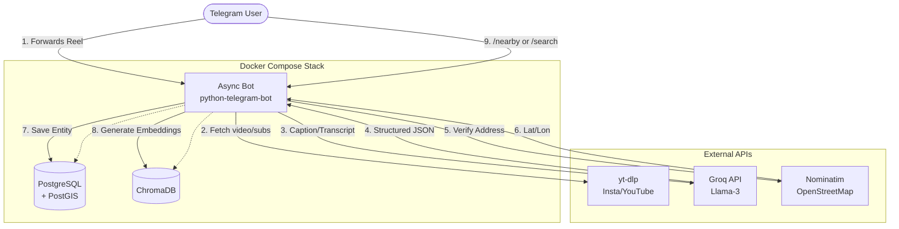

# RILA (AI Agent for Searchable Video Memory)

[](https://www.python.org/downloads/release/python-3110/)
[](https://www.docker.com/)
[](https://opensource.org/licenses/MIT)

**RILA** is an AI-powered Telegram bot that acts as a personal knowledge base for places and entities discovered in short-form video content (Instagram Reels, YouTube Shorts). 

Have you ever watched a reel about a great hidden gem, a new restaurant, or a temporary deal, only to lose the video and forget the name? RILA solves this. Simply forward a reel to the bot, and it will automatically ingest the video, transcribe the audio, use an LLM to extract structured entities, verify their real-world existence via geocoding, and save them into a searchable, geospatially-aware database.

## 🌟 Key Features

- **Automated Ingestion:** Downloads reels via `yt-dlp` and falls back to `faster-whisper` for offline ASR if closed captions are unavailable.
- **LLM-Powered Extraction:** Utilizes Groq (Llama-3.3-70b) constrained to a strict Pydantic schema to extract distinct, concrete entities (places, deals, government schemes, educational info).
- **Anti-Hallucination Geocoding:** Filters out LLM hallucinations by cross-referencing extracted places against real-world OpenStreetMap data using Nominatim, ensuring only valid locations are pinned.
- **Semantic Vector Search:** Embeds all extracted context into ChromaDB, allowing you to find saved places using natural language (e.g., `/search cozy cafe for reading`).
- **Geospatial Awareness:** Built on PostgreSQL with PostGIS. Share your live location on Telegram to instantly see your closest saved places.
- **Multi-User Secure:** Locked down via Telegram User ID whitelisting.

---

## 🏗️ Architecture

RILA is built on a containerized microservice architecture, separating the async Telegram bot interface from the heavy data ingestion and extraction pipelines.



## 🛠️ Tech Stack

- **Language:** Python 3.11
- **Interface:** `python-telegram-bot`
- **Databases:** PostgreSQL (Relational), PostGIS (Geospatial), ChromaDB (Vector)
- **ORMs:** SQLAlchemy, GeoAlchemy2
- **AI/ML:** Groq API (Llama-3.3-70b-versatile), `faster-whisper` (Local ASR), `sentence-transformers` (all-MiniLM-L6-v2)
- **Ingestion:** `yt-dlp`
- **Infrastructure:** Docker, Docker Compose

---

## 🚀 Installation & Setup

RILA is designed to be fully self-hosted. You will need Docker and Docker Compose installed.

### 1. Environment Variables
Copy the example environment file and fill in your credentials:
```bash
cp .env.example .env
```
Required variables:
- `BOT_TOKEN`: Your Telegram Bot token from [@BotFather](https://t.me/botfather).
- `GROQ_API_KEY`: Your API key from [Groq](https://console.groq.com/).
- `ALLOWED_USER_ID`: Your numeric Telegram User ID (get it from [@userinfobot](https://t.me/userinfobot)) to keep the bot private.

### 2. Instagram Authentication (Cookies)
While YouTube Shorts can be downloaded anonymously, Instagram actively blocks anonymous downloads. To allow RILA to download Instagram reels, provide an authenticated cookie file.

> **Important:** Do not automate Instagram login or use your primary account's credentials in a script, as this violates Instagram's Terms of Service and can get your account banned. Instead, use a manual export method.

1. Install a browser extension like **"Get cookies.txt LOCALLY"** (Chrome/Firefox).
2. Open a new tab and log into [instagram.com](https://instagram.com).
3. Click the extension icon and select **Export**.
4. Save the file as `instagram_cookies.txt`.
5. Place this file inside the `cookies/` directory in the root of the repository (`cookies/instagram_cookies.txt`). This directory is gitignored.
6. Ensure `INSTAGRAM_COOKIES_PATH=/app/cookies/instagram_cookies.txt` is set in your `.env`.

### 3. Run the Stack
Start the databases and the bot container:
```bash
docker compose up --build -d
```

---

## 📱 Usage

1. **Start:** Message `/start` to your bot on Telegram.
2. **Save a Reel:** Simply forward any Instagram Reel or YouTube Shorts link to the bot. It will automatically process it, extract the entities, verify them, and save them.
3. **Find Nearby:** Share your live location attachment in the chat. RILA will run a PostGIS `ST_DWithin` query and return the closest saved locations.
4. **Semantic Search:** Use `/search <query>` (e.g., `/search best sushi deals`) to search your saved entities via ChromaDB vector similarity.

---

## ⚠️ Known Limitations

- **Cookie Expiry:** Instagram cookies expire periodically (typically every few weeks to months). When RILA starts failing to download Instagram reels with a "Private video" or similar access error, you will need to re-export the cookies and replace the file. This is expected maintenance for a personal tool.
- **Geocoding Rate Limits:** Nominatim's public API strictly enforces a limit of 1 request per second. RILA respects this limit internally, which means processing a reel with 10+ locations may take 10-15 seconds.

## 🔮 Future Roadmap

- **Cloud Deployment:** Migration guides for deploying on ARM-based cloud instances (e.g., Oracle Cloud Always Free Tier) to run 24/7.
- **Expiry Watchdogs:** Background tasks to notify the user when a saved "deal" or "scheme" is about to expire.
- **Web Dashboard:** A lightweight web frontend mapping out all saved locations.
